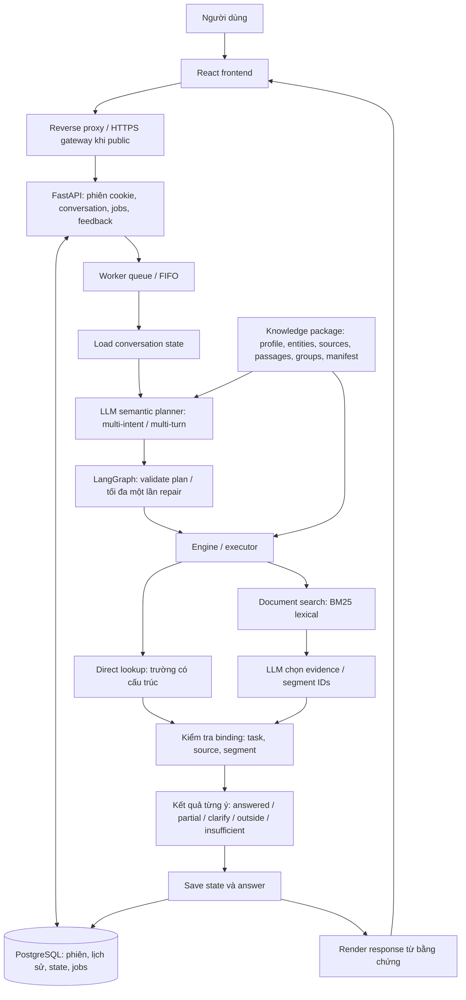

# LLM tư vấn hành chính công và hệ thống hỏi đáp tái sử dụng

Repository bàn giao source code để đọc, đánh giá kiến trúc, chạy kiểm thử và triển khai trên máy riêng. Gồm **G8 — LLM tư vấn hành chính công** và **G8.5 — hệ thống LLM reusable với dataset thay thế được**. Mỗi hệ thống có backend, frontend, migration database, lockfile và Docker riêng; không cần snapshot/image lịch sử của tác giả.

Pipeline được phát triển cho hỏi đáp thủ tục hành chính/pháp lý theo nguồn. G8.5 tách lõi hỏi đáp khỏi dataset và chính sách hành chính để tái sử dụng cho tài liệu nội bộ hoặc lĩnh vực khác **trong capability hiện có**. Đây không phải luật sư AI, không phải mô hình fine-tune để ghi nhớ corpus, và không tự bảo đảm dữ liệu pháp lý còn hiệu lực.

## 1. Hai thư mục source

| Thư mục | Vai trò | Hướng dẫn |
| --- | --- | --- |
| `G8-Source-code-LLM-tu-van-hanh-chinh-cong/` | Source code LLM tư vấn hành chính công; giữ catalog và các boundary nghiệp vụ | [README G8](G8-Source-code-LLM-tu-van-hanh-chinh-cong/README.md) |
| `G8.5-He-thong-LLM-reusable/` | Hệ thống LLM reusable, chọn knowledge package riêng cho deployment | [README G8.5](G8.5-He-thong-LLM-reusable/README.md) |

```text
.
├── G8-Source-code-LLM-tu-van-hanh-chinh-cong/
│   ├── backend/         # FastAPI, auth, jobs, state, grounding, G8 graph
│   ├── frontend/        # React, TypeScript, Vite; chat và lịch sử
│   ├── source-service/  # MCP tra cứu hành chính, opt-in
│   ├── data/administrative/  # Corpus JSONL đã chuẩn hóa
│   ├── compose.yaml
│   └── .env.example
├── G8.5-He-thong-LLM-reusable/
│   ├── backend/         # API + reusable planner/executor/package loader
│   ├── frontend/        # UI đọc title/capability từ profile
│   ├── profiles/        # Profile và mapping mẫu, chưa chọn dataset thật
│   ├── examples/        # 3 bản ghi giả lập kiểm thử phần mềm
│   ├── compose.yaml
│   └── .env.example
└── tools/               # Kiểm tra cấu trúc bản public
```

Không đưa vào Git: ReciFineGold/bộ pilot/package recipe, model weights, credentials, `.env` thật, DB/lịch sử chat, log, tunnel state, `.runtime`, node_modules, báo cáo nghiên cứu/thử nghiệm và các deployment G1–G7 cũ. Ba README là hướng dẫn bản bàn giao, không phải các báo cáo riêng trên máy tác giả. Alpha/Beta/Gamma là ví dụ viết mới, không lấy từ dataset bên ngoài.

G8 còn namespace `app/rag/g3`, `g4`, `g5`, `g7` vì đang import các module nền đó; không phải các server cũ phải khởi động. G8.5 không mang theo engine/policy hành chính của G8.

## 2. Pipeline hệ thống



Sơ đồ mô tả hướng kiến trúc reusable QA, không coi tất cả capability đều bật ở mọi dataset. G8 chủ yếu dùng direct cho các trường hành chính đã cấu trúc; document package của G8.5 đi nhánh search. Direct chỉ dùng khi package hỗ trợ.

LLM hiểu yêu cầu, chọn đối tượng và quan hệ giữa lượt hội thoại, không tự thêm giá trị rồi gắn citation. Với search G8.5, model chọn ID đoạn/segment và server render lát văn bản gốc; evidence phải thuộc đúng task. Direct lấy các trường/đoạn đã review, không sinh fact mới.

Một câu nhiều ý có trạng thái riêng cho ý đủ nguồn, thiếu, cần làm rõ hoặc ngoài phạm vi. State giữ focus/thứ tự lựa chọn để xử lý “mục thứ hai”, đổi chủ đề, sửa nhu cầu và hỏi tiếp. Lịch sử khác version dataset không được đưa lại vào context mới.

## 3. Công nghệ và điểm đọc code

| Thành phần | Công nghệ / vị trí |
| --- | --- |
| API | Python 3.12, FastAPI, Pydantic; `backend/app/main.py` |
| Persistence | PostgreSQL, SQLAlchemy async, Alembic; `models.py`, `jobs.py`, `migrations/` |
| UI | React, TypeScript, Vite; `frontend/src/App.tsx`, `components/MessageView.tsx` |
| Cookie session | `accounts.py`, `auth.py`, `browser_sessions.py`, frontend `services/browserSession.ts` |
| Planner G8 | `app/rag/g7/planner.py`, graph/guard trong `app/rag/g8/` |
| Lõi G8.5 | `app/rag/g85/{planner,contracts,engine,knowledge,retriever,package_loader}.py` |
| Onboarding G8.5 | `backend/tools/ingest.py`, `tools/validate.py`, `profiles/` |
| Model server | HTTP `/v1/chat/completions`, JSON schema output; chạy riêng |

Triển khai tham chiếu dùng **Qwen3-8B, GGUF Q4_K_M** qua llama.cpp. “8B” là khoảng 8 tỷ tham số, “Q4_K_M” là lượng tử hóa weights giảm tài nguyên, không phải fine-tune trên dataset dự án. Không kèm weights. Endpoint khác cần đúng contract JSON schema và kiểm thử lại chất lượng/timeout/context; tương thích HTTP chưa đủ.

Dependency được khóa trong `backend/uv.lock`, `frontend/package-lock.json`, G8 `source-service/uv.lock`. Đường model local không cần API key trả phí. Hosted API cần bổ sung auth transport và rà quyền gửi dữ liệu, không gửi tài liệu nội bộ sang cloud chỉ bằng cách đổi URL.

## 4. Chạy trên máy riêng

Cần Docker + Compose và model server tương thích. Test/importer ngoài Docker cần Python 3.12 + `uv`; frontend cần Node đáp ứng `package.json`. Xem README từng hệ thống cho lệnh đầy đủ.

Model server tham khảo, thay đường dẫn GGUF và thông số theo phần cứng:

```powershell
llama-server -m /path/to/model.gguf --alias G8-Qwen3-8B-Q4 --host 0.0.0.0 --port 8180 --jinja --reasoning off --ctx-size 24576 --parallel 2 --n-gpu-layers 99 --temp 0 --seed 42 --chat-template-kwargs '{"enable_thinking":false}'
```

`0.0.0.0` cho container gọi model qua host; **chặn cổng model từ Internet bằng firewall**. Không public inference endpoint không có auth. CPU có thể chạy với cấu hình phù hợp nhưng chậm hơn. Đây là cấu hình tham khảo, không cam kết tốc độ/VRAM. Xem [llama.cpp server](https://github.com/ggml-org/llama.cpp/blob/master/tools/server/README.md) về JSON schema và serving.

Trong mỗi thư mục, copy `.env.example` sang `.env`, thay password riêng đủ mạnh và sửa model URL/name. G8.5 còn phải tạo/chọn knowledge package. Sau đó:

```powershell
docker compose up -d --build --wait
```

| Hệ thống | Frontend review | Note |
| --- | --- | --- |
| G8 | [http://localhost:13008](https://g8-hanh-chinh.tail108af4.ts.net/) | hệ thống trả lời theo dataset hành chính công do phường Tăng Nhơn Phú HCM cấp |
| G8.5 | [http://localhost:13085](https://g85-nau-an.tail108af4.ts.net/) | hệ thống được reuse bằng một bộ data nấu ăn ReciFineGold để test thử khả năng reuse |

Project/port/volume review tách khỏi deployment tham chiếu. Backend build từ Python + lockfile, không dùng image riêng `g7-...:baseline`. DB mới tự migrate; corpus/package bind read-only, **không import corpus vào bảng chat**. Không dùng `down -v` khi cần giữ history.

## 5. Kiểm thử và đánh giá

Trong `backend/` của mỗi hệ thống:

```powershell
uv sync --frozen
uv run pytest -q
```

Trong `frontend/`:

```powershell
npm ci
npm test
npm run build
```

Test offline không cần GPU/hosted LLM: kiểm tra contract/state/hash/review/binding và hồi quy. Test phần mềm không chứng minh model đúng mọi câu. Đánh giá thêm với model thật, câu hỏi mới và hội thoại dài; phân biệt lỗi retrieval, planner và evidence selection. Câu đã dùng sửa hệ thống là dev/regression, không gọi là test mù.

Bản bàn giao đã kiểm tra build Docker độc lập và startup/migration với database mới cho cả hai hệ thống. Bộ test đi kèm: G8 backend 56, G8.5 backend 17, MCP source-service 78, frontend mỗi hệ thống 46 ca. Smoke trình duyệt chạy lượt model thật trên corpus G8 và ví dụ giả lập G8.5, kiểm tra visitor/renewal, reload, tab mới và mở lại bằng cookie. Đây là các kiểm tra có giới hạn, không phải accuracy benchmark.

Smoke có thể chạy từ gốc repo sau khi đã `npm ci` và cài Chromium trong frontend (`npx playwright install chromium`):

```powershell
node tools/browser_smoke.cjs --system g8
node tools/browser_smoke.cjs --system g85
# Tùy chọn --query "câu hỏi theo dataset đang phục vụ" --expect "đoạn cần có"
```

Không có `--query` thì chỉ thử shell/history, không gọi model. Smoke tạo phiên/hội thoại synthetic riêng, không đọc phiên người dùng có sẵn và không lưu giá trị cookie ra file/log.

Hành chính/pháp lý cần kiểm tra địa phương, hiệu lực, nguồn áp dụng. Review không đồng nghĩa nội dung luôn còn hiệu lực. Repo không đưa ra accuracy tổng quát hay production SLA dựa trên vài ảnh demo.

## 6. Cookie, bảo mật và public deployment

Visitor UI tự tạo/khôi phục phiên: mở trang là hỏi được. Cookie chỉ giữ mã phiên opaque, `HttpOnly`, `SameSite=Lax`; chat/state nằm trong PostgreSQL. Phiên mặc định 90 ngày, gia hạn sau xác thực. Backend vẫn xác thực token và quyền sở hữu mỗi conversation, không dùng guest account chung.

Xóa cookie/ẩn danh/đổi thiết bị không tự lấy lịch sử cũ; cookie không phải backup. Web Locks phối hợp các tab khi tạo phiên, browser không hỗ trợ Web Locks không có cùng bảo đảm chống tạo phiên đồng thời.

Compose review bind **127.0.0.1**, chưa phải production public. Khi ra Internet cần HTTPS gateway, cookie Secure, Origin allowlist đúng domain, rate limit/queue, che route nội bộ, backup DB và chính sách lưu/xóa lịch sử. Không kèm account/config/state tunnel tác giả.

G8 có MCP source-service opt-in, tra nguồn hiện tại sau sự đồng ý của người dùng. G8.5 mặc định `external_lookup=false`, `actions=false`, không tự gọi Internet khi hỏi đáp. Dependency MCP còn trong lockfile kế thừa shell không có nghĩa capability đã bật.

Source công khai không tự chuyển quyền sở hữu/license của model, dependency hoặc dataset. Repo không cấp license mới cho dữ liệu bên thứ ba. Corpus G8 giữ classification/provenance gốc, không thay thế cơ sở dữ liệu pháp luật chính thức.

## 7. Cuối cùng: khi thay dataset G8.5 cần thay gì?

1. Nguồn được phép sử dụng, ID/title/text, mapping cột JSONL/CSV.
2. Profile mới: tên/domain/ngôn ngữ/scope/capability/attributes/limits đúng nguồn; mặc định `policies=[]`, `planner_instructions=[]`.
3. Package version mới: manifest/profile/groups/entities/sources/passages, hash/locator/review hợp lệ.
4. `.env` → `KNOWLEDGE_PACKAGE_PATH`, recreate backend lúc hết lượt đang chạy, reload nginx nếu backend đổi IP. Frontend đọc profile qua `/api/v1/domain`, không cần build lại để đổi tên dataset.
5. Bộ expected task/status/evidence lấy từ nguồn mới; đo recall/grounding và hội thoại tiếp nối.

Trong contract/capability hiện có, không cần sửa lõi theo tên từng record hay train lại model. Importer baseline chỉ xử lý document JSONL/CSV, giữ nguyên text; PDF/DOCX/Excel cần ETL trước, direct lookup cần package cấu trúc theo attribute. Catalog hiện tối đa **64 entity**, **8 task/lượt**, BM25 lexical, một lần repair. Dataset lớn, dense multilingual retrieval, reranker, dịch có kiểm chứng, action hoặc adapter mới có thể cần mở rộng code và kiểm thử. “Reusable” không có nghĩa bỏ bất kỳ file nào vào cũng tự chạy tốt.

Nguồn đầy đủ hơn có thể giúp coverage nhưng không tự sửa mọi lỗi planner/retrieval/relevance. Xem [G8.5](G8.5-He-thong-LLM-reusable/README.md) cho lệnh ingest/validate/activate/rollback.
